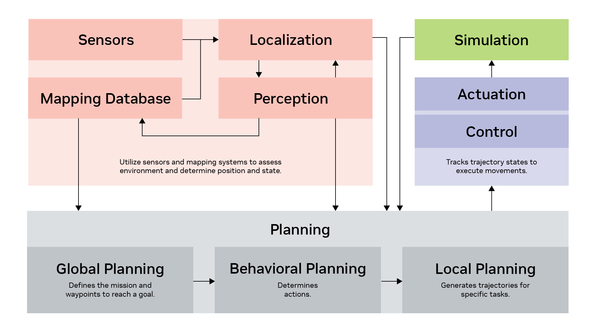

# Robotic Systems and Architectures

## Core Components

- **Perception and Localization:** Utilizes sensors such as cameras and LIDAR, along with mapping systems, to assess the environment and determine the robot's position and state.

- **Planning:** Planning involves multiple stages.
    - **Global Planning:** Similar to setting a route on a map, defining the mission and waypoints to reach a goal.
    - **Behavior Planning:** Determines actions, such as which object to manipulate and how.
    - **Local Planning:** Generates trajectories for specific tasks, guiding the robot through precise paths.

- **Control and Actuation:** The controller tracks trajectory states to execute movements, whether for manipulation or navigation. Outcomes are tested in both virtual simulations and real-world scenarios.

- **Feedback Loop:** Continuously gathers data from sensors and localization to refine planning and improve system performance. This iterative process ensures adaptive and responsive robot behavior.
